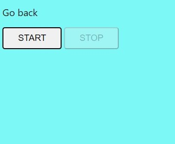
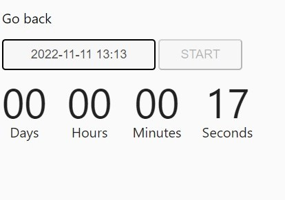
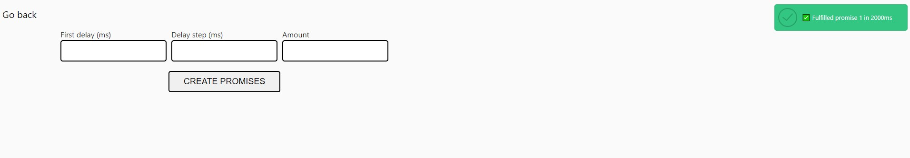

## The project is based on Parcel.

## Task №1 Color Switcher

#### 1. The written script, which, after pressing the "Start" button, changes color once a second photo <body> to a random value. When recording on the "Stop" button, the color change lights should stop.

#### 2. While the theme change is being pushed, the Start button is inactive.

#### 3. The getRandomHexColor function is used to generate a random color:

```
function getRandomHexColor() {
  return `#${Math.floor(Math.random() * 16777215).toString(16)}`;
}
```



## Task №2 Countdown timer

#### 1. A timer script has been written that counts down to a certain date.

#### 2. Timer markup, end date selection fields, and buttons are written, when clicking on which the timer starts. Added minimal element decoration interface.

#### 3. The flatpicker library is used to allow the user to cross-browser select the end date and time in one interface element.

#### 4. Date selection The onClose() method from the parameters object is called every time closing the UI element that flatpicker creates.

#### 5. If the user has selected a date in the past, show a notification with the text "Please choose a date in the future". If the user has chosen a valid date (in the future), the "Start" button becomes active. The "Start" button is not active until as long as the user has not selected a date in the future. By pressing the "Start" button the countdown to the selected date starts from the moment you press it.

#### 6. Countdown When you click on the "Start" button, the script calculates once a second how much time is left until the specified date and updates the timer interface, showing four digits: days, hours, minutes, and seconds in xx:xx:xx:xx format.

#### 7. The number of days can be more than two digits. The timer stops when reached the end date, i.e. 00:00:00:00. If the timer is running, then select a new date and restart it - you need to restart the page.

#### 8. The convertMs function is used to calculate values, where ms is the difference between end and current date in milliseconds.

```
function convertMs(ms) {
  // Number of milliseconds per unit of time
  const second = 1000;
  const minute = second * 60;
  const hour = minute * 60;
  const day = hour * 24;

  // Remaining days
  const days = Math.floor(ms / day);
  // Remaining hours
  const hours = Math.floor((ms % day) / hour);
  // Remaining minutes
  const minutes = Math.floor(((ms % day) % hour) / minute);
  // Remaining seconds
  const seconds = Math.floor((((ms % day) % hour) % minute) / second);

  return { days, hours, minutes, seconds };
}

console.log(convertMs(2000)); // {days: 0, hours: 0, minutes: 0, seconds: 2}
console.log(convertMs(140000)); // {days: 0, hours: 0, minutes: 2, seconds: 20}
console.log(convertMs(24140000)); // {days: 0, hours: 6 minutes: 42, seconds: 20}
```

#### 9. Time Formatting The convertMs() function returns an object with the calculated remaining time until the end date. It does not format the result. That is, if there are 4 minutes left or any other time component, then the function will return 4, not 04. In the timer interface, added 0 if there are less than two characters in the number. Wrote a function addLeadingZero(value) that uses the padStart() method and format the value before drawing the interface.



## Task №3 Promise generator

#### 1. HTML has a form markup in which the user will enter the first latency in milliseconds, delay increase step for each promise after the first and the number of promises to be created.

#### 2. A script has been written that, when submitting the form, calls the function createPromise(position, delay) as many times as entered in the amount field. At each call, I pass to it the number of the created promise (position) and the delay taking into account the first delay (delay) and step (step) entered by the user.

#### 3. The createPromise function returns one promise, which cleared or rejected after a time delay. Promise value an object in which the position and delay properties are with values ​​of the same name parameters.


